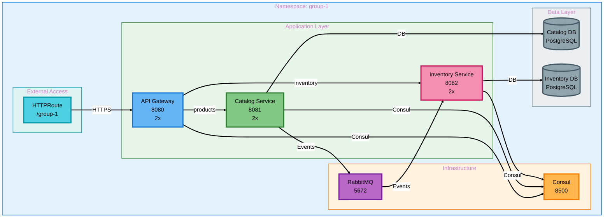
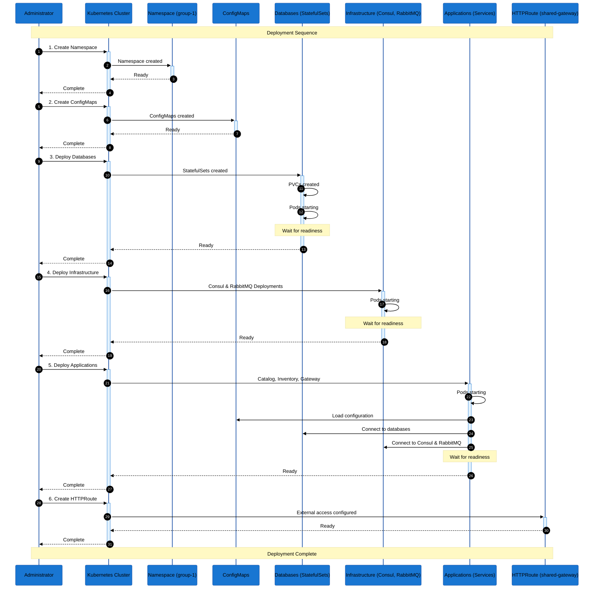
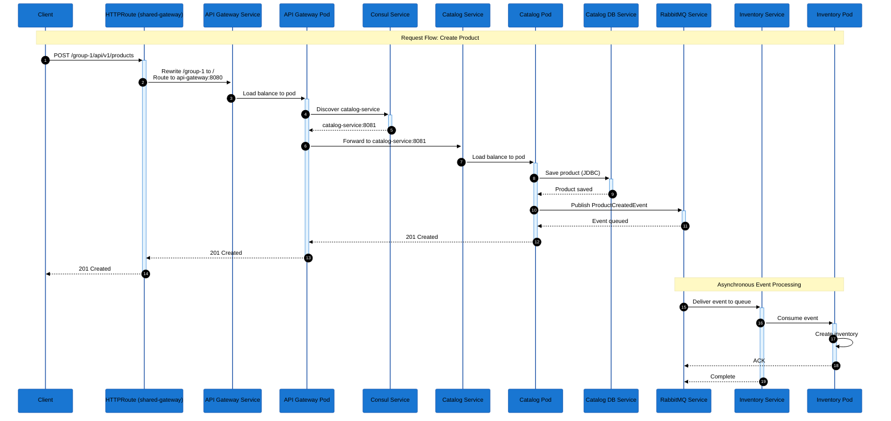

# Kubernetes Deployment Solution

## Overview

This solution demonstrates how to deploy the asynchronous microservices application (`03b-microservices-async`) to Kubernetes. The deployment includes all application services, infrastructure components (databases, message broker, service discovery), and proper configuration management.

## Architecture on Kubernetes



## Kubernetes Resources Overview

### Resource Types Used

| Resource Type | Purpose | Components |
|--------------|---------|------------|
| **Namespace** | Logical isolation | `group-1` |
| **Deployment** | Stateless applications | API Gateway, Catalog Service, Inventory Service, Consul, RabbitMQ |
| **StatefulSet** | Stateful applications with stable identity | Catalog DB, Inventory DB |
| **Service** | Network abstraction and load balancing | All components |
| **ConfigMap** | Configuration data | All services |
| **HTTPRoute** | External access via Gateway API | API Gateway |

## Deployment Sequence



## Resource Details

### 1. Namespace

**File**: `manifests/namespace/namespace.yaml`

- **Purpose**: Logical isolation of resources
- **Name**: `group-1`
- **Labels**: Used for resource organization

### 2. ConfigMaps

**Purpose**: Externalize configuration from container images

**ConfigMaps Created**:
- `catalog-service-config`: Database, Consul, RabbitMQ connection settings
- `inventory-service-config`: Database, Consul, RabbitMQ connection settings
- `api-gateway-config`: Consul connection settings
- `consul-config`: Consul configuration
- `rabbitmq-config`: RabbitMQ credentials
- `postgres-config`: Catalog database settings
- `postgres-inventory-config`: Inventory database settings

**Key Configuration**:
- Service discovery: Services use Kubernetes DNS names (e.g., `consul`, `rabbitmq`, `catalog-db`)
- Database URLs: Use service names instead of `localhost`
- Ports: Use service ports, not container ports

### 3. Databases (StatefulSets)

**Why StatefulSet?**
- **Stable identity**: Pods have predictable names (`catalog-db-0`, `inventory-db-0`)
- **Persistent storage**: Each pod gets its own PersistentVolumeClaim
- **Ordered deployment**: Pods are created and terminated in order
- **Stable network**: Headless service provides stable DNS

**Key Features**:
- **PersistentVolumeClaim**: 5Gi storage per database
- **Headless Service**: `clusterIP: None` for direct pod access
- **Health Checks**: `pg_isready` for liveness and readiness
- **Resource Limits**: Memory and CPU constraints

### 4. Infrastructure Components

#### Consul (Deployment)
- **Type**: Deployment (stateless in dev mode)
- **Replicas**: 1
- **Port**: 8500 (HTTP API)
- **Health Check**: `/v1/status/leader` endpoint

#### RabbitMQ (Deployment)
- **Type**: Deployment
- **Replicas**: 1
- **Ports**: 
  - 5672 (AMQP)
  - 15672 (Management UI)
- **Health Check**: `rabbitmq-diagnostics ping`
- **Storage**: `emptyDir` (ephemeral, for development)

### 5. Application Services

#### API Gateway (Deployment)
- **Replicas**: 2 (high availability)
- **Port**: 8080
- **Health Checks**: 
  - Liveness: `/actuator/health/liveness`
  - Readiness: `/actuator/health/readiness`
- **Resources**: 512Mi-1Gi memory, 250m-500m CPU

#### Catalog Service (Deployment)
- **Replicas**: 2
- **Port**: 8081
- **Dependencies**: Catalog DB, Consul, RabbitMQ
- **Health Checks**: Spring Boot Actuator endpoints

#### Inventory Service (Deployment)
- **Replicas**: 2
- **Port**: 8082
- **Dependencies**: Inventory DB, Consul, RabbitMQ
- **Health Checks**: Spring Boot Actuator endpoints

### 6. Services (ClusterIP)

**Purpose**: 
- Provide stable DNS names
- Load balance traffic across pod replicas
- Abstract pod IP addresses

**Service Types**:
- **ClusterIP**: Internal cluster access (all application services)
- **Headless** (`clusterIP: None`): Direct pod access (databases)

**Service Names** (used in ConfigMaps):
- `consul` → Consul service discovery
- `rabbitmq` → RabbitMQ message broker
- `catalog-db` → Catalog database
- `inventory-db` → Inventory database
- `catalog-service` → Catalog microservice
- `inventory-service` → Inventory microservice
- `api-gateway` → API Gateway

### 7. HTTPRoute (Gateway API)

**HTTPRoutes**:
1. **API Gateway Route** (`api-gateway-httproute`):
- **Parent Gateway**: `shared-gateway` in namespace `default`
- **Listener**: `https` (port 443, TLS terminated)
- **Path**: `/group-1` → URLRewrite to `/` → routes to `api-gateway:8080`
- **Controller**: `io.cilium/gateway-controller`

2. **Swagger Route** (`swagger-httproute`):
   - **Parent Gateway**: `shared-gateway` in namespace `default`
   - **Listener**: `https` (port 443, TLS terminated)
   - **Paths**:
     - `/group-1/swagger/catalog/**` → routes to `catalog-service:8081`
     - `/group-1/swagger/inventory/**` → routes to `inventory-service:8082`
   - **URL Rewrite**: Removes `/group-1/swagger/{service}` prefix

**Key Features**:
- Uses the shared Gateway API infrastructure
- Path-based routing with URL rewriting
- TLS termination at the gateway level
- No need to create a separate Gateway (uses existing `shared-gateway`)
- Swagger UI accessible via dedicated routes

**Access URLs**:
- Base API: `https://<gateway-ip>/group-1`
- Swagger Catalog: `https://<gateway-ip>/group-1/swagger/catalog/swagger-ui/index.html`
- Swagger Inventory: `https://<gateway-ip>/group-1/swagger/inventory/swagger-ui/index.html`

## Deployment Commands

### 1. Create Namespace
```bash
kubectl apply -f manifests/namespace/namespace.yaml
```

### 2. Create ConfigMaps
```bash
kubectl apply -f manifests/configmaps/
```

### 3. Deploy Databases
```bash
kubectl apply -f manifests/deployments/catalog-db-statefulset.yaml
kubectl apply -f manifests/deployments/inventory-db-statefulset.yaml
kubectl apply -f manifests/services/catalog-db-service.yaml
kubectl apply -f manifests/services/inventory-db-service.yaml

# Wait for databases to be ready
kubectl wait --for=condition=ready pod -l app=catalog-db -n group-1 --timeout=300s
kubectl wait --for=condition=ready pod -l app=inventory-db -n group-1 --timeout=300s
```

### 4. Deploy Infrastructure
```bash
kubectl apply -f manifests/deployments/consul-deployment.yaml
kubectl apply -f manifests/deployments/rabbitmq-deployment.yaml
kubectl apply -f manifests/services/consul-service.yaml
kubectl apply -f manifests/services/rabbitmq-service.yaml

# Wait for infrastructure to be ready
kubectl wait --for=condition=ready pod -l app=consul -n group-1 --timeout=300s
kubectl wait --for=condition=ready pod -l app=rabbitmq -n group-1 --timeout=300s
```

### 5. Deploy Applications
```bash
kubectl apply -f manifests/deployments/catalog-service-deployment.yaml
kubectl apply -f manifests/deployments/inventory-service-deployment.yaml
kubectl apply -f manifests/deployments/api-gateway-deployment.yaml
kubectl apply -f manifests/services/catalog-service-service.yaml
kubectl apply -f manifests/services/inventory-service-service.yaml
kubectl apply -f manifests/services/api-gateway-service.yaml

# Wait for applications to be ready
kubectl wait --for=condition=ready pod -l app=catalog-service -n group-1 --timeout=300s
kubectl wait --for=condition=ready pod -l app=inventory-service -n group-1 --timeout=300s
kubectl wait --for=condition=ready pod -l app=api-gateway -n group-1 --timeout=300s
```

### 6. Create HTTPRoute
```bash
# Create HTTPRoute (uses shared-gateway)
kubectl apply -f manifests/routing/api-gateway-httproute.yaml
```

### 7. Verify Deployment
```bash
# Check all pods
kubectl get pods -n group-1

# Check services
kubectl get services -n group-1

# Check deployments
kubectl get deployments -n group-1

# Check HTTPRoute
kubectl get httproutes -n group-1

# Check gateway status
kubectl get gateway shared-gateway -n default
```

## Network Flow



## Key Kubernetes Concepts

### Deployment vs StatefulSet

| Feature | Deployment | StatefulSet |
|---------|-----------|-------------|
| **Use Case** | Stateless applications | Stateful applications |
| **Pod Identity** | Random names | Stable, ordered names |
| **Storage** | Shared volumes | Individual PVCs per pod |
| **Scaling** | Any order | Ordered (0→1→2) |
| **Service** | Regular ClusterIP | Headless (clusterIP: None) |
| **Examples** | API Gateway, Services | Databases, Message Queues |

### Service Types

| Type | Use Case | External Access |
|------|----------|-----------------|
| **ClusterIP** | Internal communication | No (cluster-internal only) |
| **NodePort** | External access via node IP | Yes (node IP + port) |
| **LoadBalancer** | Cloud provider load balancer | Yes (external IP) |
| **Headless** | Direct pod access | No (DNS returns pod IPs) |

### Health Checks

**Liveness Probe**:
- Detects if container is running
- If fails → container is restarted
- Example: HTTP endpoint, command execution

**Readiness Probe**:
- Detects if container is ready to serve traffic
- If fails → pod removed from service endpoints
- Example: Health check endpoint, database connection

### Resource Management

**Requests**:
- Minimum resources guaranteed
- Used for scheduling decisions
- Example: `requests: { memory: "512Mi", cpu: "250m" }`

**Limits**:
- Maximum resources allowed
- Container killed if exceeded
- Example: `limits: { memory: "1Gi", cpu: "500m" }`

## Troubleshooting

### Pod Not Starting
```bash
# Check pod status
kubectl describe pod <pod-name> -n group-1

# Check logs
kubectl logs <pod-name> -n group-1

# Check events
kubectl get events -n group-1 --sort-by='.lastTimestamp'
```

### Service Not Accessible
```bash
# Verify service endpoints
kubectl get endpoints -n group-1

# Test service connectivity
kubectl run -it --rm debug --image=busybox --restart=Never -n group-1 -- wget -O- http://catalog-service:8081/actuator/health
```

### Configuration Issues
```bash
# View ConfigMap
kubectl get configmap catalog-service-config -n group-1 -o yaml

# Check environment variables in pod
kubectl exec <pod-name> -n group-1 -- env | grep SPRING
```

### Database Connection Issues
```bash
# Check database pod
kubectl logs catalog-db-0 -n group-1

# Test database connectivity from application pod
kubectl exec -it <catalog-pod> -n group-1 -- wget -O- http://catalog-db:5432
```

## Best Practices

1. **Resource Limits**: Always set requests and limits to prevent resource starvation
2. **Health Checks**: Implement liveness and readiness probes for all services
3. **Configuration**: Externalize configuration using ConfigMaps and Secrets
4. **Storage**: Use StatefulSets for databases with PersistentVolumeClaims
5. **High Availability**: Run multiple replicas for stateless services
6. **Namespaces**: Use namespaces for logical isolation
7. **Labels**: Use consistent labels for resource selection
8. **Startup Order**: Consider init containers or operators for dependency management

## Next Steps

- **Horizontal Pod Autoscaling (HPA)**: Automatically scale based on CPU/memory
- **Resource Quotas**: Limit resource usage per namespace
- **Network Policies**: Restrict network traffic between pods
- **Monitoring**: Integrate with Prometheus and Grafana
- **Logging**: Centralized logging with ELK stack or Loki
- **CI/CD**: Automate deployments with GitOps (ArgoCD, Flux)

---

**See also**:
- [`EXERCISE.md`](EXERCISE.md) - Hands-on exercise for students
- [`README.md`](README.md) - Quick start guide
- [`../03b-microservices-async/README.md`](../03b-microservices-async/README.md) - Application documentation
